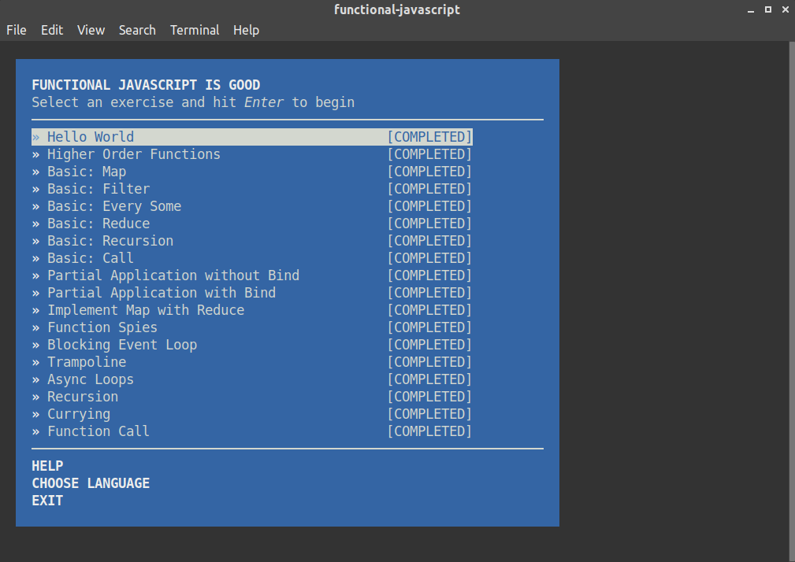
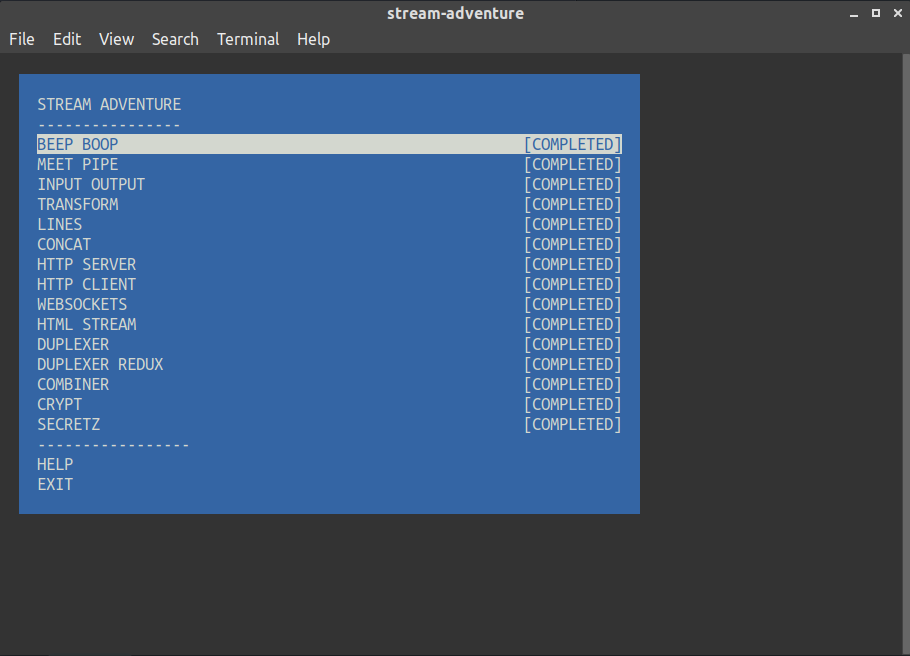

# kottans-backend

### Task List
- [X] Git Basics
- [X] Unix Shell
- [X] VCS (hello gitty), GitHub and Collaboration
- [X] Language-specific Topics: Part I
- [X] Memory Management
- [ ] TCP, UDP, Network
- [ ] HTTP & HTTPs
- [ ] Design Patterns: Intro
- [ ] Data Structures
- [ ] File System
- [ ] Runtime, Ecosystem and I/O
- [ ] Databases
- [ ] Language-specific Topics: Part II

## Git Basics

> refreshed knowledge

## Unix Shell


> pipes & filters very useful
> IO redirection

## Git Collaboration

> refreshed some topics from https://learngitbranching.js.org/

## NodeJS Basics 1



> many different libs
> not enough docs & instructions

## Memory Management
> When program reaches maximum limit of stack: we have a **stack overflow** and the program receives a Segmentation Fault.
> When program requests a big (more then 128KB) memory allocation on heap: will be created an anonymous mapping instead of using heap memory.
> The difference between Text and Data memory segments: the data segment holds the contents for static variables initialized in source code, text segment store all strings and maps binary file in memory (compiled program).

```md
55eaba7cd000-55eabcc98000 rw-p 00000000 00:00 0               [heap]
7f75b4988000-7f75b4989000 r--p 00000000 fd:00 11273728        /usr/lib/x86_64-linux-gnu/girepository-1.0/GL-1.0.typelib
7f75b4989000-7f75b4990000 r--p 00000000 fd:00 11273767        /usr/lib/x86_64-linux-gnu/girepository-1.0/Json-1.0.typelib
7f75b4990000-7f75b4994000 r--p 00000000 fd:00 11273795        /usr/lib/x86_64-linux-gnu/girepository-1.0/cairo-1.0.typelib
7f75b4994000-7f75b4995000 rw-s 00000000 00:2e 32              /i915 (deleted)
7f75b4995000-7f75b4996000 rw-s 00000000 00:34 20              /run/user/121/xwayland-shared-KedX9L (deleted)
7f75b4997000-7f75b499a000 rw-s 00000000 00:2e 159             /i915 (deleted)
7f75b499e000-7f75b49a2000 rw-s 00000000 00:2e 19              /i915 (deleted)
7f75b49a2000-7f75b49ac000 rw-s 00000000 00:2e 736             /i915 (deleted)
7f75b49ac000-7f75b49b0000 rw-s 00000000 00:2e 23              /i915 (deleted)
7f75b49b8000-7f75b4af9000 rw-s 00000000 fd:00 15074975        /var/lib/gdm3/.cache/mesa_shader_cache/index
7f75b4af9000-7f75b4b28000 r--p 00000000 fd:00 11934875        /usr/share/glib-2.0/schemas/gschemas.compiled
7f75b4b28000-7f75b4b65000 rw-p 00000000 00:00 0 
7f75b4b65000-7f75b4b66000 r--p 00000000 fd:00 11931676        /usr/share/locale-langpack/en/LC_MESSAGES/gtk30.mo
7f75b4b66000-7f75b4b67000 rwxp 00000000 00:00 0 
7f75b4b68000-7f75b4b69000 rw-s 00000000 00:2e 36              /i915 (deleted)
7f75b4b69000-7f75b4b71000 rw-s 00000000 00:2e 746             /i915 (deleted)
7f75b4b71000-7f75b4b78000 r--s 00000000 fd:00 11273591        /usr/lib/x86_64-linux-gnu/gconv/gconv-modules.cache
7f75b4b78000-7f75b4b7a000 r--p 00000000 fd:00 14288087        /var/lib/gdm3/greeter-dconf-defaults
7f75b4b7a000-7f75b4b7b000 r--p 00000000 fd:00 15076527        /var/lib/gdm3/.config/dconf/user
7f75b4b7b000-7f75b4b7c000 r--s 00000000 00:34 19              /run/user/121/dconf/user
7f75b4b7c000-7f75b4b7e000 rw-p 00000000 00:00 0 
7f75b4b7e000-7f75b4b7f000 r--p 00027000 fd:00 10621900        /lib/x86_64-linux-gnu/ld-2.27.so
7f75b4b7f000-7f75b4b80000 rw-p 00028000 fd:00 10621900        /lib/x86_64-linux-gnu/ld-2.27.so
7f75b4b80000-7f75b4b81000 rw-p 00000000 00:00 0 
7fff9f896000-7fff9f8d9000 rw-p 00000000 00:00 0               [stack]
7fff9f8e2000-7fff9f8e5000 r--p 00000000 00:00 0               [vvar]
7fff9f8e5000-7fff9f8e6000 r-xp 00000000 00:00 0               [vdso]
ffffffffff600000-ffffffffff601000 r-xp 00000000 00:00         [vsyscall]
```
`Heap - 55eaba7cd000-55eabcc98000`, `Stack - 7fff9f896000-7fff9f8d9000`, `MMS - 7f75b4b7e000-7f75b4b7f000`.