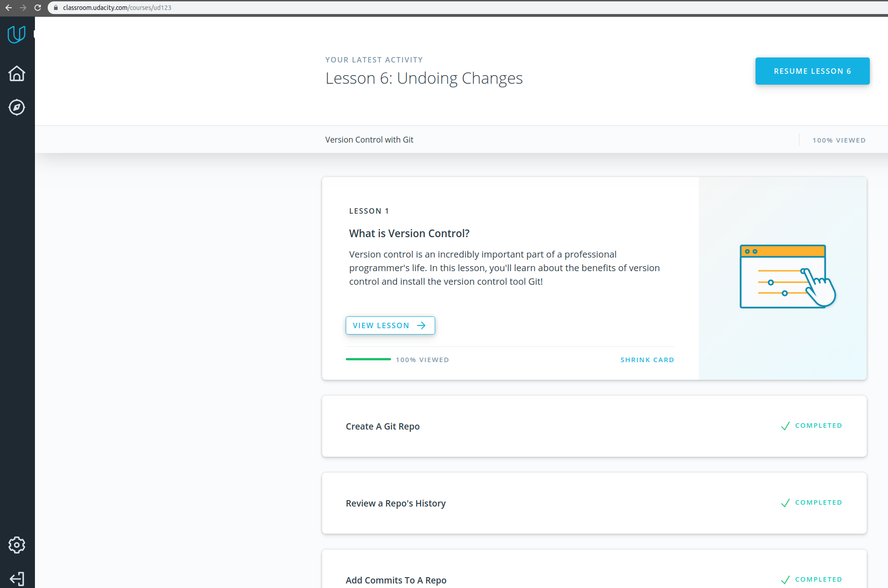
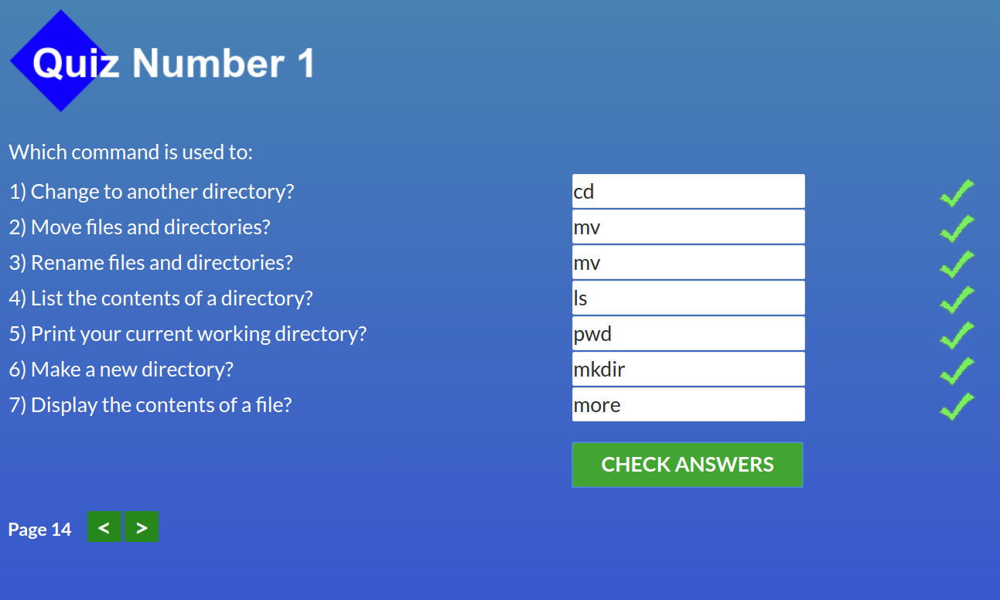
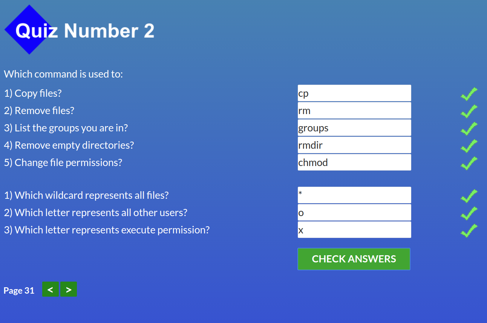
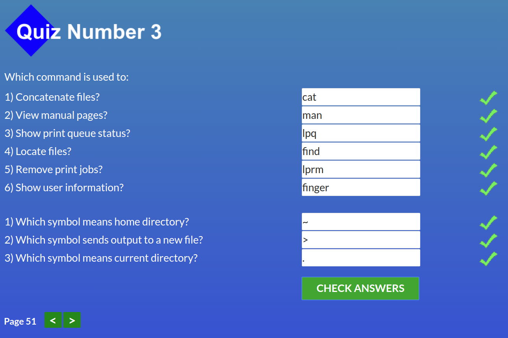
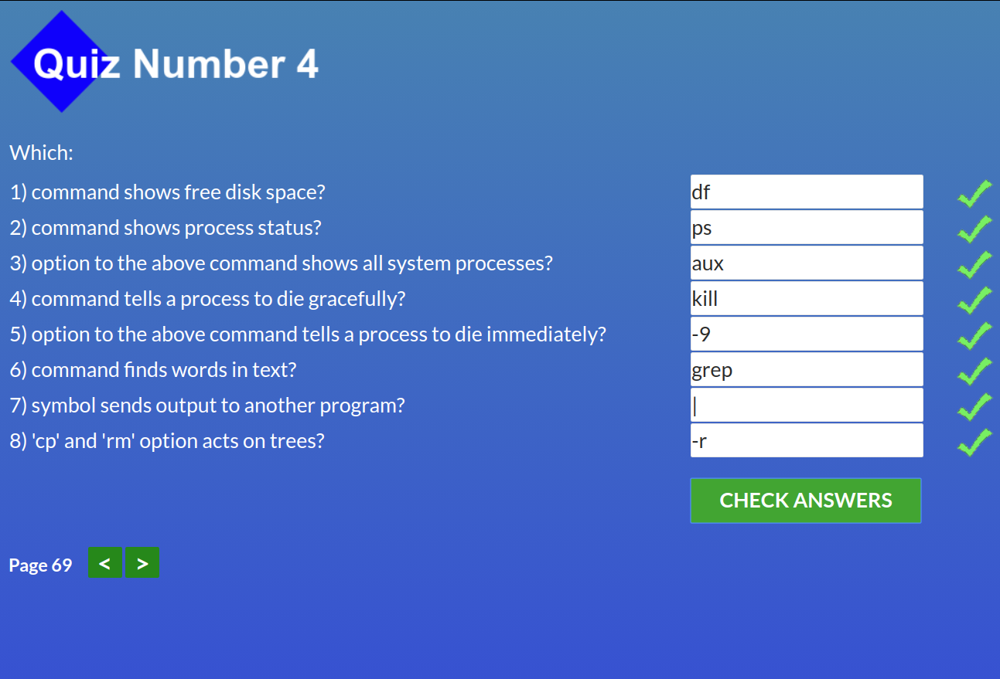
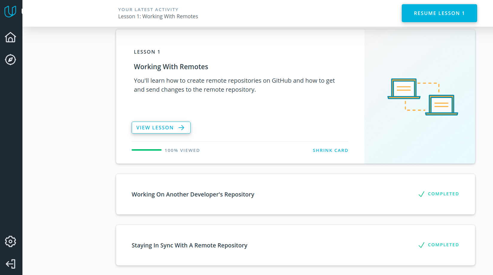
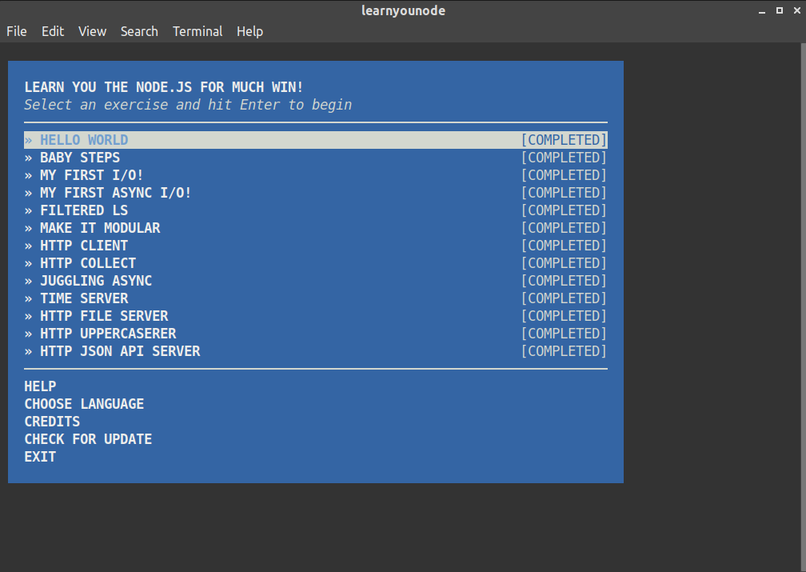

# kottans-backend

### Task List
- [X] Git Basics
- [X] Unix Shell
- [X] VCS (hello gitty), GitHub and Collaboration
- [X] Language-specific Topics: Part I
- [ ] Memory Management
- [ ] TCP, UDP, Network
- [ ] HTTP & HTTPs
- [ ] Design Patterns: Intro
- [ ] Data Structures
- [ ] File System
- [ ] Runtime, Ecosystem and I/O
- [ ] Databases
- [ ] Language-specific Topics: Part II

## Git Basics

> refreshed knowledge

## Unix Shell

> pipes & filters very useful
> IO redirection

## Git Collaboration

> refreshed some topics from https://learngitbranching.js.org/

## NodeJS Basics 1
